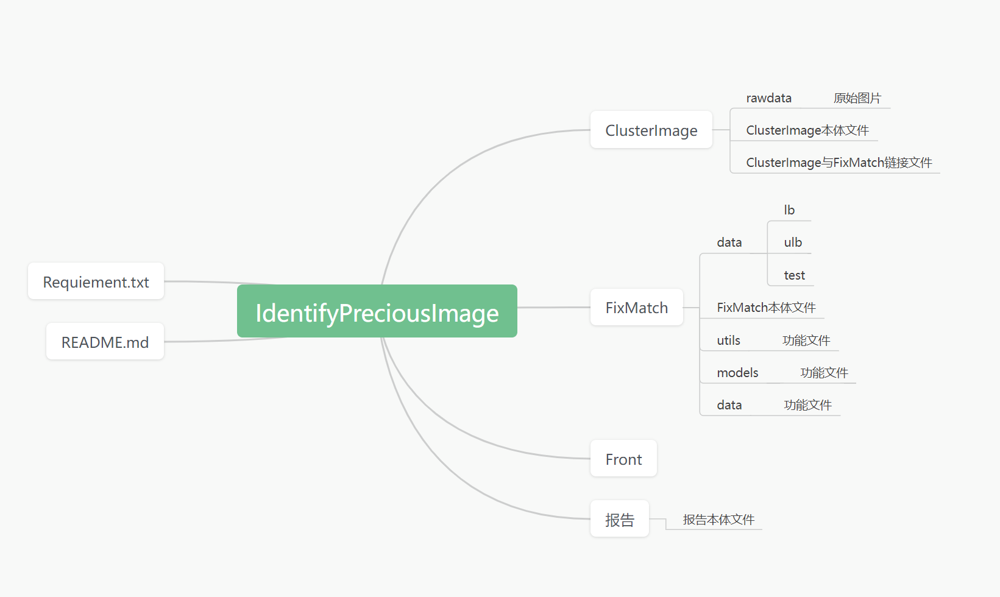

# ToDo

- [ ] xxy：完善ClusterImage
  - [ ] 协助提供测试数据集
  - [ ] ClusterImage功能介绍，代码介绍报告
- [ ] ljw：前端
  - [ ] 完成初版前端界面（周五晚十二点前）
- [ ] jxh：FixMatch
  - [ ] 收集测试数据集（不耽误代码测试）
  - [ ] GPU服务器代码训练测试（下周一十二点前）
- [ ] fxy：报告
  - [ ] 初版商业应用报告
  - [ ] 整合ClusterImage报告
- [ ] cbl：模块统一与git管理
  - [ ] 协助git管理
  - [ ] 协助提供测试数据集
  

# ClusterImage

1. 代码本体（以函数/类形式，从而可以从其他py文件调用）

   能够从指定图片集中，选择出指定数量的，彼此差异最大的图片子集

   输入：从`./rawdata`文件夹读取图片
   函数接受参数：`n`输出图片子集的元素个数（默认是45）

   输出：一个包含`n`个元素的List，元素内容是图片文件名			

2. 超参数测试

   若函数涉及超参数（比如PCA或HOG），尽量做些测试加以比较，选择效果/效率的最好参数。

3. 代码解释与测试报告

   写一个word 来解释代码逻辑 以及 超参数测试的报告（这个不急，等整体代码跑通了再写）

# GitHub存储拓扑图

