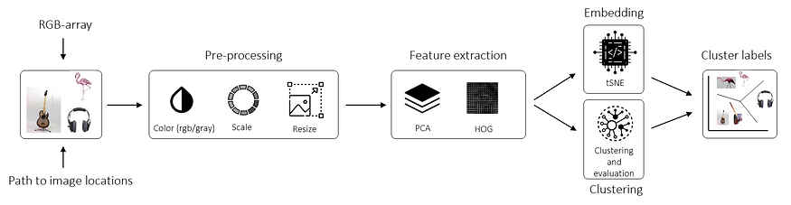
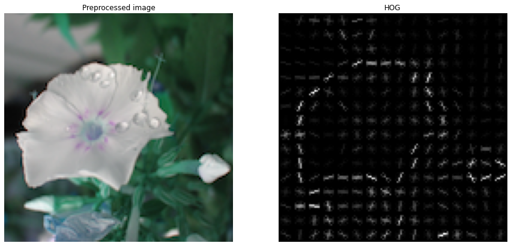
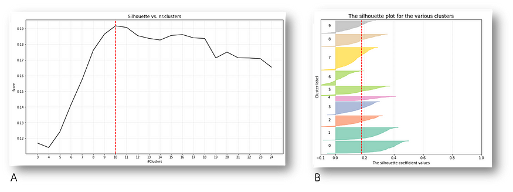
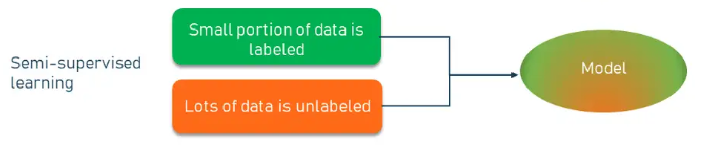
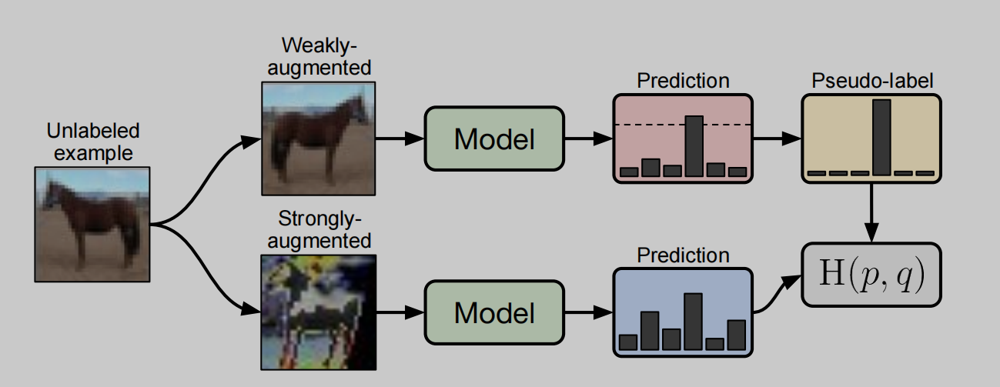
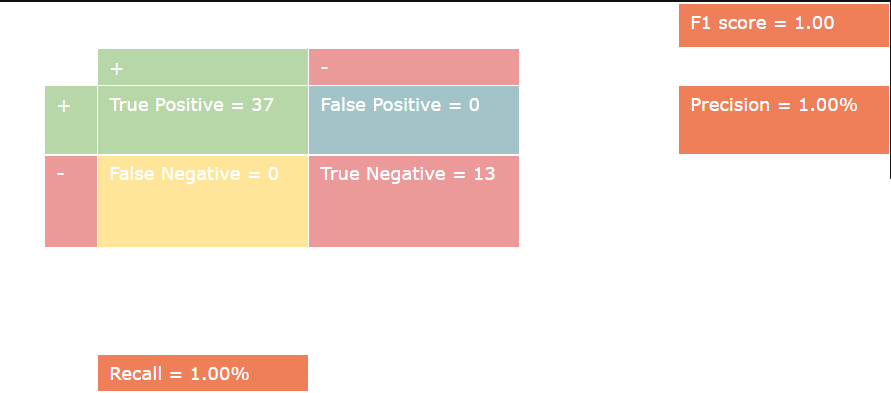
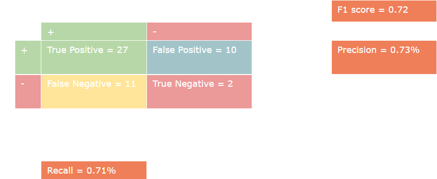
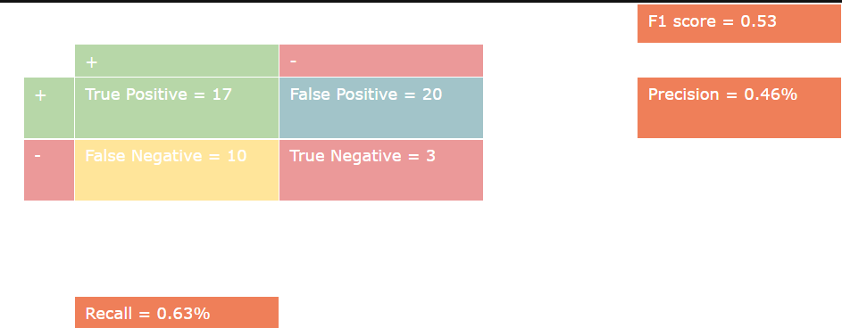

# 基于FixMatch的预测用户照片选择偏好模型

## 一句话概括我们的项目

​	基于K-means图像聚类和FixMatch半监督学习,通过用户少量选择照片偏好,训练出定制模型,以预测用户要删除的手机相册照片。

## 代码运行示范

1. 从`requirment.txt`中安装依赖库
2. 将工作环境(working directory)设置为`IdentifyPreciousImage`
3. 运行`python ./UI/src/main.py`
4. 注册账号并登录（已有账号可直接登录）
5. 点击`Import`按钮导入图片。等待终端中弹出`completed`提示
6. 点击`Manage`标记训练数据/点击`Test`标记测试数据
7. 点击`Delete`按钮，点击`Renew model`训练模型/点击`Apply model`应用已训练完毕模型

## 应用场景

​	在数字摄影的时代，每个人都可以轻松地拍摄和存储大量照片。然而，照片拍摄越来越容易，导致了相册照片的冗杂，清理相册成为了一项重要工作。为了帮助用户更有效地管理其照片库，我们提出了一个基于半监督学习的解决方案，通过分析用户的偏好来帮助预测哪些照片最有可能被用户选择删除。

​	该项目致力于用最少的标签数据训练快捷训练出“千人千面”的分类器模型。一方面，每个用户删除照片的习惯都是独一无二的，在缺少极大数据量的情况下我们难以训练出适配所有人的大模型。故而，我们寻求轻量化的模型，以快捷地为每个用户训练出定制模型。另一方面，我们希望我们的产品是易于使用的，用户不需要提供几千份数据标签，只需要提供尽可能少的标签数据就可以享受我们的产品。

​	本项目采用图像聚类和半监督学习技术来解决上述问题。项目首先对用户上传的照片提取特征，提取出最能反应总体特征的若干张图片，待用户标记少量图片后，再通过半监督学习算法完成模型的训练。

​	本项目不仅局限于辅助删除垃圾图片，还可以有更多衍生用途。如根据用户偏好生成的精选照片集，能为用户提供便捷的照片回顾体验，帮助其快速浏览重要记忆等。并且，只要稍加修改，本项目就能转变为适配任何场景的半监督分类器。可以完成比如训练医学图像识别、识别考古文字等诸多缺乏标注数据的场景。关于拓展应用的讨论请参见后文。

## 模型解释

### 图片预处理

​	在数据预处理阶段，我们采用了一种结合质量调整和分辨率缩减的图片压缩方法，通过逐步降低图片的质量参数，文件大小有效减少，同时保留图像的基本特征。当质量调整未能使文件大小达到预定目标时，我们进一步通过减小图片分辨率直至单张图片大小至3kb左右。

​	此压缩策略，它能在确保一定图像质量的前提下，显著减少后续模型的训练时间。同时，由于后续算法的特性可以在一定程度上抵抗图像质量的下降，该压缩对模型训练效果的影响有限。因此，尽管压缩可能导致一些像素级的细节丢失，但对于模型识别出关键特征并进行有效分类的能力影响有限。

### 基于K-means的图片聚类

​	本项目为了尽可能提高有限标签数据所包含的信息量，采用图片聚类的方式，提取出最能代表整体趋势的少部分图片。下面将具体阐述本项目是如何进一步**预处理图像**、**提取特征**（PCA、HOG），以及在**考虑分类评分（好坏）的情况下对相似度高的图像进行聚类**。

#### 特征提取

​	我们可以使用PCA、HOG等方法来提取特征，利用图片的像素值信息。

- **Principal component analysis（PCA）**

​	通过 PCA，我们可以提取主成分（PC）并减少特征向量的长度。假设100张128x128像素的已预处理后的灰度图像堆叠成一个新的阵列，特征提取将在的阵列上进行。并且能够通过参数控制所需的主成分个数。

- **Histogram of Oriented Gradients（HOG）**

​	HOG侧重于描述物体的结构或形状。它将完整的图片划分为若干个区域，并会为每个区域分别生成一张有向梯度直方图（利用像素值的梯度方向生成，如图）。通过HOG，我们可以从图像数据中提取与边缘方向相关的特征，能够简化图像，只包含重要的信息，如局部区域中梯度方向的出现次数。
​	

#### 基于评分的图像聚类

​	聚类完毕后，我们需要使用一些能够评估聚类好坏的评分方法，如DB index和Silhouette score。

- Davies–Bouldin index（DB index）

​	DB index评估的是每个聚类的“中心”之间的欧氏距离，其输出在 [0,1] 之间，评分越低，聚类效果越好。

- Silhouette score

​	Silhouette score评估了每一个图片与它所在聚类的相似程度，以及该图片和相邻聚类的像素程度，其输出在 [-1,1] 之间，评分越高，表明该图片与它所在聚类的相似程度越高。

### 神经网络图像分类模型

#### 半监督图像分类

​	半监督图像分类是一种图像分类方法,它利用有限的标注数据以及大量的未标注数据进行训练。它的目的是当标注数据稀缺时,利用未标注数据提高模型的性能。具体做法是先用有标注的少量数据训练出一个初始模型,然后用该模型预测未标注数据的标签,再把这些伪标签与有标注的数据一起重新训练模型。这样通过迭代不断校正伪标签,最终得到一个性能更好的分类模型。

#### FixMatch

​	在这个项目中，我们受Kihyuk等前人启发，采用FixMatch作为我们的半监督图像分类模型。FixMatch结合了一致性正则化和伪标签法，它可以利用大量的未标记数据和少量的标记数据生成准确性极高的分类模型。它的核心思想如下图所示：

​	针对一张无标签图像，FixMatch先对其分别施加弱增强（如平移、反转等）和强增强（如颜色失真等）产生两张图片，再分别预测二者的标签数据。假如弱增强图片的预测结果中有一类的概率超过了所设定的阈值，则生成伪标签，假定这张图片就属于此种分类。接着将强增强图片的预测结果与伪标签生成交叉熵，记作无标签数据的损失函数值。如果弱增强图片生成的预测结果皆没有超过阈值，则此张图片在这个迭代中不参与损失函数的计算。以此，随着模型的不断训练，会有越来越多的无标签数据参与训练当中。

​	有标签数据则采用常规方法计算出损失函数。并结合二者产生出模型损失函数（表示无标签数据权重）：

  

​	基于此基本思想，FixMatch能够有效利用少量有标签数据，并逐渐挖掘出无标签数据中的信息量，从而训练出准确率较高的分类模型。

## 模型表现与解读

### 模型表现

​	由于模型的训练成本较高，以及训练数据涉及大量个人敏感数据（手机图片），我们仅基于组内三名成员的手机图片训练出三组模型，分别称为J、F、C。所有模型基于45张有标签数据和315张无标签数据训练而成，除J模型有追加测试数据外，所有模型表现基于训练数据之外随机抽选的50张标签数据。由于在二分类问题中，准确度难以准确体现分类器表现，我们汇报Recall值和Precision值，并给出相应的混淆矩阵和F1-score。
​	J模型在50张测试数据中达到100%的准确度，对所有测试数据皆分类正确。我们于是追加了200张测试数据，共250张（其中150张为1/删除，100张为0/不删除），模型准确度仍然达到100%。

​	F模型在50张测试数据中Recall达0.71，Precision达0.73。F模型表现虽不如J模型，但仍较为均衡，表现尚可接受。

​	C模型在50张测试数据中Recall达0.63，Precision仅有0.46。相较于没有删除垃圾照片而言，错误删除珍贵照片更加令人难以接受。故C模型过低的Precision值意味着其表现较差。

### 模型表现解读

​	这三个模型分别基于我们小组三位同学的手机照片数据训练。其中J删除照片习惯极为稳定，手机内各类照片来源也较为稳定；F删除照片习惯波动较多，手机内各类照片的来源也随时间的不同而有较大差异；C则是平日就有删除整理照片的习惯，导致训练数据中绝大多数都是保留数据，训练数据极其不平衡。
​	从中可以看出，本模型假设训练目标（用户删除照片的习惯）是稳定的、不变的，即可以通过训练数据学习到与测试数据相同的删除照片的模式：

  

​	但在部分用户情况下，这个假设可能失效。或者由于部分用户已然删除垃圾图片，导致训练数据不平衡、信息量丢失。

## 模型创新性与拓展

​	本模型是首个在Github上实现可以基于自定义数据集训练的FixMatch开源模型。此外，我们增加了基于K-means的图片聚类作为前置步骤，尽可能提高有限标签数据的信息量，有效强化模型对数据信息量的利用。并搭建了相应的UI界面，便于用户使用。
​	此模型还可以通过修改超参数（总分类个数等），快捷地修改为针对任何任务的分类模型。可以用于包括医学影视诊断或考古图片解读等标记数据稀少，专家标记数据获得成本高的图像分类问题。

## 致谢

1. 本项目中的图片聚类模型参考了Python库clustimage ([clustimage’s documentation! — clustimage clustimage documentation (erdogant.github.io)](https://erdogant.github.io/clustimage/pages/html/index.html))
1. Sohn, Kihyuk, et al. "Fixmatch: Simplifying semi-supervised learning with consistency and confidence."*Advances in neural information processing systems*33 (2020): 596-608.
1. 本项目中FixMatch模型参考了GitHub用户kekmodel的代码(https://github.com/kekmodel/FixMatch-pytorch)

